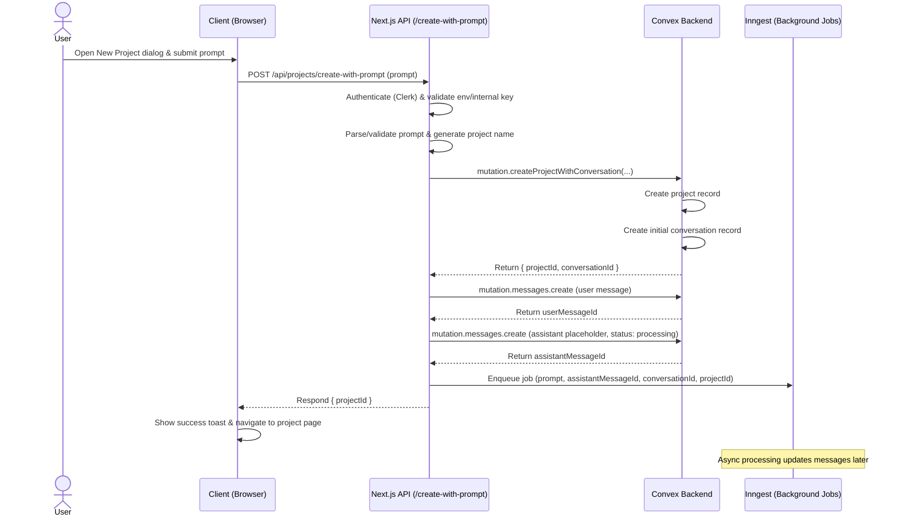

<div align="center">

# 🌟 Polaris

### An AI-powered code editor — Cursor, but evolved.

[](https://nextjs.org/)
[](https://convex.dev/)
[](https://www.inngest.com/)
[](https://clerk.com/)
[](LICENSE)

[Demo](#demo) · [Features](#features) · [Architecture](#architecture) · [Getting Started](#getting-started) · [Contributing](#contributing)

</div>

---

## What is Polaris?

**Polaris** is a full-stack, AI-native code editor built on top of the ideas behind Cursor — and then pushed further. Submit a prompt, and Polaris spins up a project, seeds a conversation, and streams back AI-generated code in the background, all without blocking your workflow.

Think of it as your personal AI pair programmer that lives in the browser, backed by a real-time reactive database, durable background jobs, and rock-solid authentication.

---

## Features

- **Prompt-to-Project in seconds** — describe what you want to build; Polaris names the project, scaffolds it, and starts the AI conversation automatically.
- **Real-time collaborative backend** — powered by [Convex](https://convex.dev/), every message, status update, and code change is reactive and instantly reflected across clients.
- **Non-blocking AI generation** — heavy LLM work is offloaded to [Inngest](https://www.inngest.com/) background jobs, so the UI stays snappy while code is being generated.
- **Secure by default** — authentication handled end-to-end by [Clerk](https://clerk.com/); every API route is gated and every mutation is user-scoped.
- **Conversation history** — every project gets its own persistent conversation thread with user and assistant turns stored in Convex.
- **Assistant placeholder pattern** — an optimistic assistant message (status: `processing`) is created immediately so the UI can render a loading state before the background job completes.

---

## Architecture

Polaris follows a clean separation between the UI, the API layer, the reactive database, and the async job runner.

```
User → Browser → Next.js API → Convex → Inngest (async)
                                ↑
                         Real-time sync
                                ↓
                            Browser
```

### Request Lifecycle (Create Project with Prompt)



### Tech Stack

| Layer | Technology |
|---|---|
| Framework | [Next.js 15](https://nextjs.org/) (App Router) |
| Backend / Database | [Convex](https://convex.dev/) |
| Background Jobs | [Inngest](https://www.inngest.com/) |
| Authentication | [Clerk](https://clerk.com/) |
| Language | TypeScript |
| Styling | Tailwind CSS |

---

## Getting Started

### Prerequisites

- Node.js 18+
- A [Convex](https://dashboard.convex.dev/) account
- A [Clerk](https://dashboard.clerk.com/) account
- An [Inngest](https://app.inngest.com/) account
- An OpenAI (or compatible) API key

### 1. Clone the repo

```bash
git clone https://github.com/anuPhoenixbis/polaris.git
cd polaris
```

### 2. Install dependencies

```bash
npm install
```

### 3. Set up environment variables

Copy the example env file and fill in your keys:

```bash
cp .env.example .env.local
```

```env
# Clerk
NEXT_PUBLIC_CLERK_PUBLISHABLE_KEY=pk_...
CLERK_SECRET_KEY=sk_...

# Convex
NEXT_PUBLIC_CONVEX_URL=https://your-deployment.convex.cloud
CONVEX_DEPLOY_KEY=...

# Inngest
INNGEST_EVENT_KEY=...
INNGEST_SIGNING_KEY=...

# Internal API security
INTERNAL_API_KEY=your_secret_key_here

# AI
OPENAI_API_KEY=sk-...
```

### 4. Initialize Convex

```bash
npx convex dev
```

This will deploy your Convex schema and functions and keep them in sync during development.

### 5. Start the dev server

```bash
npm run dev
```

Open [http://localhost:3000](http://localhost:3000) and start building.

---

## Project Structure

```
polaris/
├── app/
│   ├── api/
│   │   └── projects/
│   │       └── create-with-prompt/   # Main API route
│   └── (routes)/                     # Next.js app pages
├── convex/
│   ├── schema.ts                     # Database schema
│   ├── projects.ts                   # Project mutations/queries
│   └── messages.ts                   # Message mutations/queries
├── inngest/
│   └── functions/                    # Background job definitions
├── components/                       # Shared UI components
└── lib/                              # Utilities & helpers
```

---

## How It Works

1. **User submits a prompt** from the New Project dialog in the browser.
2. **The Next.js API route** authenticates the request via Clerk, validates the internal API key, and parses the prompt to derive a project name.
3. **Convex mutations** atomically create the project record and an initial conversation, then store both the user's message and an optimistic assistant placeholder (marked `processing`).
4. **Inngest receives an event** containing the prompt, message IDs, and project context — it runs the AI generation asynchronously.
5. **The browser navigates** immediately to the new project page, where Convex's real-time subscriptions surface updates as Inngest completes its work.

---

## Contributing

Contributions are welcome! Here's how to get involved:

1. Fork the repository
2. Create a feature branch: `git checkout -b feat/your-feature`
3. Commit your changes: `git commit -m "feat: add your feature"`
4. Push to your branch: `git push origin feat/your-feature`
5. Open a Pull Request

Please follow the existing code style and add tests where appropriate.

---

## License

This project is licensed under the [MIT License](LICENSE).

---

<div align="center">

Built with ❤️ by [@anuPhoenixbis](https://github.com/anuPhoenixbis)

⭐ Star this repo if you find it useful!

</div>